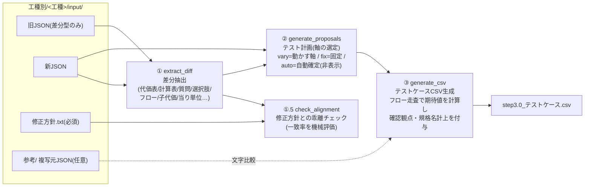
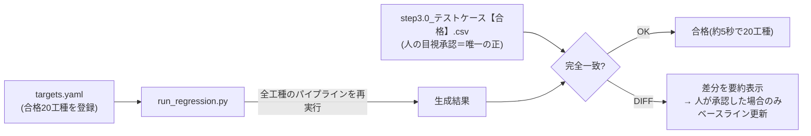

# 報告: 歩掛JSONテストケース自動生成エンジン — 精度検証フェーズ完了

報告日: 2026-06-11 / 作成: Claude (Cowork) + imoo

---

## 1. 結論サマリ

- **検証対象22工種をすべて消化**: 合格 **20工種**・スキップ 2工種（ユーザ判断）。
- 生成したテストケースは**全件、人の目視レビューで承認**（合格CSV＝唯一の正）。
- **回帰テスト基盤が完成**: エンジンを改修するたびに全20合格工種を約5秒で再生成し、
  承認済みCSVとの完全一致を機械検証。今回のフェーズ中も改修のたびに毎回実行し、
  **既存工種の品質を一度も壊さずに**新しい検知ルールを12件追加できた。

| 指標 | 値 |
|---|---|
| 検証工種 | 22（差分型14・全パターン型8） |
| 合格 | 20工種（#00〜#17, #20, #21） |
| スキップ | 2工種（#18 異形ブロック製作・#19 バックホウ） |
| 回帰テスト | 20工種 完全一致（実行 約5〜6秒） |
| 期間 | 2026-05-21 着手 〜 2026-06-11（約3週間・git実働10日） |

---

## 2. スクリプト構成（図解）

### 2.1 生成パイプライン（1工種あたり数秒）

- 実行コマンド: `python3 共通/run_koshu.py <番号>`（修正方針.txt が無い工種は生成しない）
- 旧/新の自動判定: input直下のJSONをファイル名末尾の日付で昇順ソート（同年度2回改定にも対応）

### 2.2 回帰テスト（品質の門番）

- 運用ルール: エンジンを改修したら**コミット前に必ず実行**。DIFFは「意図した変更か」を
  人が確認・承認してからベースライン更新（勝手に更新しない）。
- 工種の合格時に①目視承認したCSVを【合格】として保存、②targets.yaml へ登録するだけで
  以後自動的に回帰対象になる。

### 2.3 テストケースの絞り込み原則（組合せ爆発の解消）

「**選択でフロー（出てくる質問）が分岐する軸だけ動かす**。値が変わるだけ・自動確定・
削除済み・共通歩掛の軸は代表1件」。この原則で実例として
**75,264→4件**（#17）、**235,298→2件**（#18）、**16→1件**（#19）まで圧縮しつつ、
分岐の網羅は維持している。代表行は実機の既定選択（DefaultRowID）に一致させる。

---

## 3. 工種の精度確認結果（22工種）

一致度=修正方針と差分検知の機械突き合わせ（差分型のみ）。TC数=生成テストケース件数。

| # | 工種 | 型 | 一致度 | TC数 | 結果 |
|---|---|---|---|---|---|
| 00 | 裏込砕石工 | 差分 | 100% | 3 | ✅合格 |
| 01 | 回航費・旅費等 | 差分 | 100% | 1 | ✅合格 |
| 02 | 大型ブレーカ | 差分 | 100% | 4 | ✅合格 |
| 03 | 送気用設備運転費 | 差分 | 100% | 1 | ✅合格 |
| 04 | 下地処理工(復興係数) | 差分 | 100% | 1 | ✅合格 |
| 05 | 掘削等 | 差分 | 100% | 4 | ✅合格 |
| 06 | 土のう積工 | 差分 | 100% | 5 | ✅合格 |
| 07 | インターロッキングブロック工 | 差分 | 100% | 7 | ✅合格 |
| 08 | 薬剤(Kg) | 全パターン | — | 2 | ✅合格 |
| 09 | 養生マット(材料費)【施工P】 | 差分 | 100% | 6 | ✅合格 |
| 10 | 床掘り(ICT)(省人化) | 全パターン | — | 4 | ✅合格 |
| 11 | ICT建設機械経費加算額(小規模土工) | 差分 | 100% | 3 | ✅合格 |
| 12 | 重建設機械分解組立 | 差分 | 100% | 3 | ✅合格 |
| 13 | MC・MGバックホウ技術(ほ場整備整地工) | 差分 | 100% | 1 | ✅合格 |
| 14 | MC・MGバックホウ技術(暗渠排水工) | 全パターン | — | 1 | ✅合格 |
| 15 | プレビーム桁架設工(一式当り) | 差分 | 100% | 2 | ✅合格 |
| 16 | 静的締固め砂杭工 | 全パターン | — | 9 | ✅合格 |
| 17 | 静的締固め施工機の分解組立及び輸送 | 全パターン | — | 4 | ✅合格 |
| 18 | 異形ブロック製作 | 差分 | 100% | 4 | ⏭スキップ※1 |
| 19 | バックホウ | 差分 | 100% | 1 | ⏭スキップ※2 |
| 20 | ため池堤体盛立工 | 差分 | 100% | 1 | ✅合格 |
| 21 | 管(函)渠型側溝 | 差分 | 100% | 3 | ✅合格 |

- ※1 #18: 課題が多く構造が複雑で、精度向上の題材に不向き（ユーザ判断）。
- ※2 #19: イレギュラーな構造が多く開発コスト過大 → **制限事項「供用日の運転費は
  テストケース作成不可能」**として正式に位置づけ。

---

## 4. フィードバック対応で獲得した検知能力（このフェーズの主成果）

目視レビューのフィードバック1件ごとに「その工種だけの修正」ではなく
**全工種に効く一般ルール**としてエンジンへ実装し、回帰テストで既存工種への
影響ゼロを確認してから取り込んだ。主な獲得能力:

| 検知・観点 | 内容 | 由来 |
|---|---|---|
| 選択肢の文字修正 | セル文字列の変更を検出し「既定行＋最長選択肢」で検証（規格名計上のNG=文字欠落を最長行で検出）。数値のみの変更（歩掛改定）は除外 | #12, #19 |
| 規格名計上の観点 | 新規質問・選択肢追加/削除/文字修正で発火。軸に出ない自動確定エコー質問にも発火。影響なしのTCは「-」表示 | #11, #12, #13 |
| 文字修正の観点 | 質問表示名・代価名・代価表の備考欄・**当り単位（m2→m3）**。積算実行時に見えない計算表名称は出さない | #13, #14, #20 |
| 複写元との文字比較 | 全パターン型でも input/参考/ の複写元JSONと比較（JSON再利用を質問名一致率で自動判定） | #14 |
| 子代価の変更検知 | 送り変数(SendItemList)の増減・計上先変更 →「子代価の選択肢が意図通りか」 | #15 |
| 自動確定の範囲表 | 数値入力(W等)で必ず自動確定される質問を列から除外 | #15 |
| 既定行の一致 | 代表行を実機の既定選択(DefaultRowID)に一致（排ガス=第3次基準値） | #16 |
| 新規到達質問 | 追加選択肢（各種）経由でのみ到達する質問を発見して全選択肢網羅・正しい列順で出力 | #21 |
| 機能質問の除外 | 単価DB初期値を切り替えるだけの機能質問を列に出さない | #21 |

---

## 5. その他の報告事項

1. **人の承認を唯一の正とする運用が確立**: 生成→目視→合格CSV→回帰登録のループが
   定着し、エンジン改修の安全性と精度向上の速度を両立できている。
2. **仕様書の二本立てが機能**: 製品側の知見は `歩掛JSON内部仕様書.md`（確度ラベル付き・
   ローカル管理）へ、生成エンジンの仕様は `汎用テストケース生成仕様.md`（v2.11）へ集約。
   実データ検証スクリプト（check_spec_assumptions.py）で仕様書の主張を機械チェック
   （現在 NG=0 / WARN=3 は意味未特定の観測事項として追補済み）。
3. **残課題（次フェーズへ）**:
   - 50工種目標に向けた追加工種の選定・投入（あと約28工種）
   - SekisanEnv（積算環境設定）連動の既定選択の厳密対応（B-17系・要設計）
   - 機械区分72（#12）等、フロー上到達しない質問の実機確認
   - WARN3件（SitsumonKind=120 の意味・L~系特殊変数・Kind17のMinKigou無し例外）
4. **所要期間の実績**: エンジン初版〜9工種合格まで約2週間、その後の精度検証フェーズ
   （13工種追加・FB対応12件）は実働約3日。**1工種あたりの検証コストが大幅に低下**して
   おり、追加28工種は現体制で十分到達可能と見込む。

---

## 6. 成果物の所在

| 成果物 | パス |
|---|---|
| 生成エンジン | `共通/`（step1_diff / step1_5_check / step2_proposals / step3_csv / engine / pipeline.py / run_koshu.py） |
| 回帰テスト | `共通/regression/`（run_regression.py / targets.yaml） |
| 生成仕様書 v2.11 | `共通/spec/汎用テストケース生成仕様.md` |
| 製品内部仕様書 | `共通/source_ref/spec/歩掛JSON内部仕様書.md`（ローカルのみ） |
| 工種別の入出力 | `工種別/<番号>_<工種>/input・output`（合格CSVを含む） |
| 進捗管理 | `docs/精度検証フェーズ_工種管理.md` / `docs/タスク一覧.md` |
